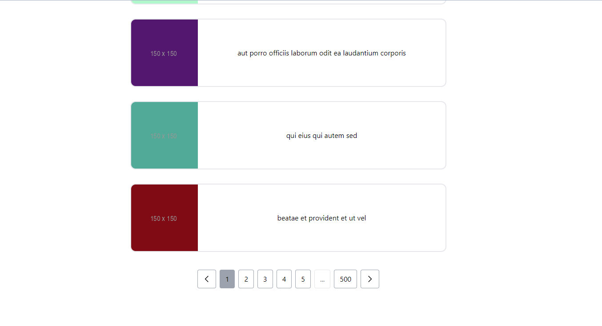

# Pagination Component


#### 1 sayfada gösterilecek kart sayısı
```javascript
// Pagination.js 9. satır
  const [count] = useState(10);
```

#### Gösterilecek kartlar
```javascript
// Pagination.js 13. satır
const res = await axios.get("https://jsonplaceholder.typicode.com/photos");
```

#### Kartların tasarımı
```javascript
// Posts.js 8. satır
<li key={post.id} className=" border-2 w-full flex justify-between items-center rounded-xl overflow-hidden">
    
    {post.title}
    <div></div>
</li>
```